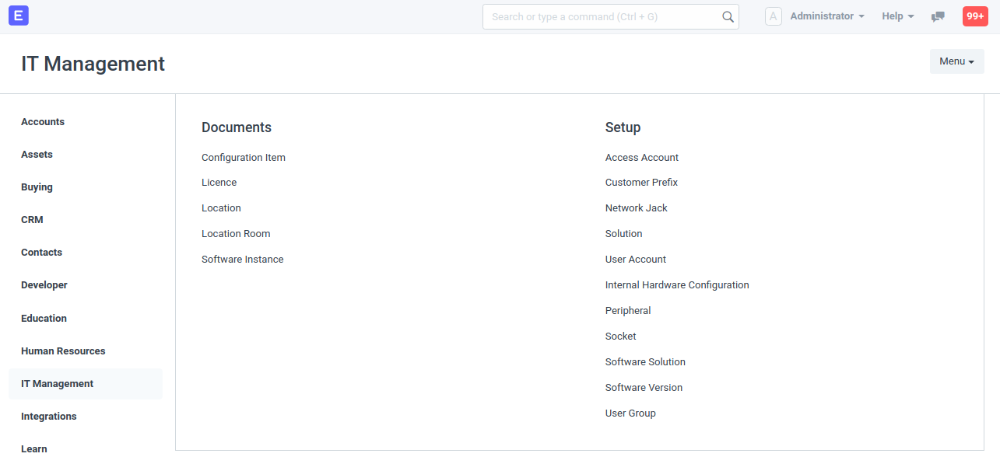

## IT Management

ERPNext App for the management of IT components. This includes IT equipment and IT solutions such as servers, computers, networks and e-mail servers as well as backups, service contracts, accounts and Internet services.

Works with ERPNext Version 11 and higher.

#### Hardware

* Configuration Item

    Notebook, Server, Monitor...

* Solution
* Socket
* Network Jack

#### Networking

* IP Address
* Subnet
* Subnet Block
* Host Domain

#### Software

* Licence

    Licence to use a Software Instance

* Software Version
* Software Instance

    Actual installation of a software (Software is an `Item`)

* User Account

    Account to access a Software Instance

* User Group

#### Locations

* Address
* Location
* Location Room

#### Service

* IT Ticket

    Turn Communication into IT Tickets and have all relevant information in one place.

#### License

GPLv3
