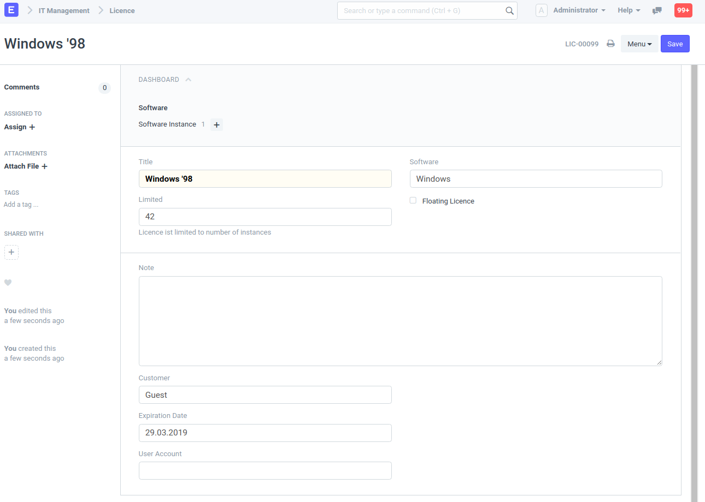

## IT Management

ERPNext App for the management of IT components. This includes IT equipment and IT solutions such as servers, computers, networks and e-mail servers as well as backups, service contracts, accounts and Internet services.

Works with ERPNext Version 11 and higher.

#### Hardware

* Configuration Item

    Notebook, Server, Monitor...

* Internal Hardware Configuration
* Solution

#### Networking

* Ethernet Jack
* IP Address
* Network Interface Controller
* Subnet
* Subnet Block
* Host Domain
* Socket

#### Software

* Licence

    Licence to use a Software Instance

* Software Version
* Software Instance

    Actual installation of a software (Software is an `Item`)

* User Account

    Account to access a Software Instance

* User Group

#### Other

* Customer Prefix
* Location
* Location Room
* Peripheral

#### License

GPLv3
